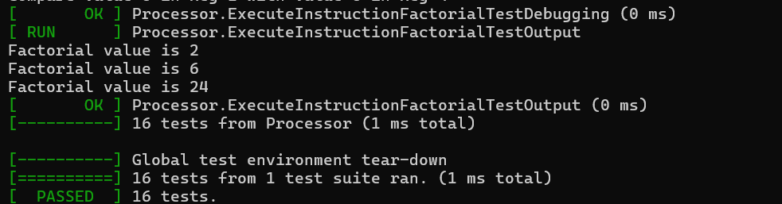

# RISC inspired Simulator
About
---------
This project creates a simple C++ RISC inspired simulator.

Building Project
----------------
This was built and tested on WSL-Ubuntu-20.04. The compiler used was GNU 9.4.0. The IDE was VS code with CMake, CMakeTools and C/C++ IntelliSense extensions. C++17 was used.

To build and run follow the steps below. 
mkdir build && cd build 
cmake .. 
make -j4 
./test-processor

A snippet of the expected output when building and running the program.

Instruction Set Architecture
-----------------------------
The instruction set consists of the following instructions 
(NOP) no operation 
(ADD) addition 
(SUB) subtraction 
(LOAD) loading from memory address into a register 
(LDI) loading an immediate value into a register 
(STORE) storing from register into memory address 
(CMP) comparing data in two registers and updating a flag 
(HALT) stop machine 
(JMP) reset next instruction by changing value of Program counter based of address held in the instruction 
(MUL) multiplication 
(ADDI) addition of a immediate value 

The instruction is reprsented by a struct that consists of three fields.
The first field is an enum representing the opcode of the different instructions. The second field represents the operand registers eg. r1, r2 ect. The third field is used to represent either an immediate value or an address depending on opcode of instruction. For example LOAD, STORE and JMP use it to respresent the address while LDI, ADDI use it for the immediat value.

The size of the instruction struct is 4 bytes.
However all the 4 bytes are not used by each instruction type. The instructions are 2 bytes (16 bits) in size.

ADD/SUB/MUL 
4 bits => opcode 
4 bits => srcReg1, srcReg2, destReg 

LOAD/STORE 
4 bits => opcode 
4 bits => destReg 
8 bits => address 

LDI 
4 bits => opcode 
4 bits => destReg 
8 bits => immediate 

CMP 
4 bits => opcode 
4 bits => srcReg1, srcReg2 
lowest 4 bits are unused 

NOP/HALT 
4 bits => opcode 
Rest of the bits are unused 

JMP 
4 bits => opcode 
8 bits => address 
lowest 4 bits are unused 

ADDI 
4 bits => opcode 
4 bits => destReg, srcReg2 
4 bits => immediate 

File Structure
-----------------------------
CMakeLists.txt - Describes the build system.

googletest-release-1.12.1 - GoogleTest library using for testing.

inc/ - Consists of processor.h and memory.h.

processor.h - Main module of system that is responsible for execution.

processor.cpp - Implementation of main module.

memory.h - Mimics hardware RAM where data can be read from and written to. Implemented for LOAD/STORE instructions.

files/ - Contains all the files used during testing.

files/SimpleAddTest - Used to initally test Execute() method. It is adding the value 5 to itself by using a combination of LDI, STORE, LOAD and ADD instructions.

files/SimpleFactorialAssembly.txt - This is the binary form of the SimpleFactorialProgram.cpp. It calculates the factorial of 4 by using a combination of LDI, ADD, CMP, MUL, ADDI and JMP instructions.

test-processor.cpp - Uses the googletest-release-1.12.1 to allow for test-driven developement of each module and function that was implemented.

The last three tests name ExecuteInstructionAddTest,ExecuteInstructionFactorialTestDebugging and ExecuteInstructionFactorialTestOutput provide the output of the Execute method.

The ExecuteInstructionAddTest inputs the SimpleAddTest.txt file and displays the debug of the instructions execution.

Similarly ExecuteInstructionFactorialTestDebugging inputs the SimpleFactorialAssembly.txt and displays the debug of the instructions execution.

The ExecuteInstructionFactorialTestOutput also inputs the SimpleFactorialAssembly.txt but displays the factorial value calculated at each iteration.

Processor
-------------
The Processor class is the main module of this project. Its private data consists of

16 general purpose 8 bit registers => std::array<unsigned char, 16> registerBank

an Instruction Memory =>
std::vector<std::string> InstructionMemory

a Memory object =>
Memory m

status registers that are represented by boolean flags => bool underflow, overflow, equalFlag, haltFlag

An incrementing object viz the Program counter that keeps track of the instructions => ProgramCounter

It consists of helper method to return the private data so that it can be tested. It also consists of method that perform actions on the instructions.
